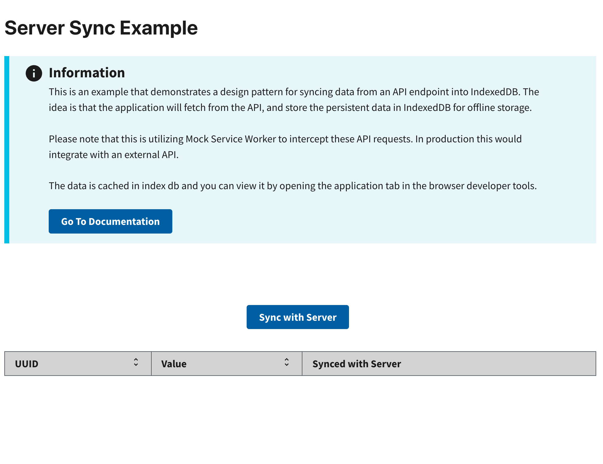

# Server Sync Example

This example shows how to synchronize data between a client application and a remote server. It handles offline status, provides feedback on the synchronization process, and manages local offline storage.

Learn more about RADFish examples at the official [documentation](https://nmfs-radfish.github.io/radfish/developer-documentation/examples-and-templates#examples). Refer to the [RADFish GitHub repo](https://nmfs-radfish.github.io/radfish/) for more information and code samples.

## Features

- Synchronizes data with a remote server.
- Handles offline status and provides appropriate messages.
- Provides a loading state during synchronization.
- Displays the last synchronization time.

## Preview

This example will render as shown in this screenshot:



## Steps

### 1. Initialize Offline Utilities
First, import these libraries:

```jsx
import { Spinner, Table, useOfflineStatus, useOfflineStorage } from "@nmfs-radfish/react-radfish";
import { MSW_ENDPOINT } from "../mocks/handlers";
```

To handle offline functionality, extract the necessary utilities from `react-radfish`:

```jsx
const { isOffline } = useOfflineStatus();
const { updateOfflineData, findOfflineData } = useOfflineStorage();
```

#### Explanation:

- `useOfflineStatus`:

  - Provides the current online/offline status of the application.
  - `isOffline`: A boolean value that indicates whether the application is offline (`true`) or online (`false`).

- `useOfflineStorage`:
  - Offers utility methods for interacting with IndexedDB or other offline storage mechanisms.
  - `updateOfflineData`:
    - Updates data in offline storage.
    - Requires the name of the storage table and the data to be updated.
    - Example:
      ```jsx
      await updateOfflineData("tableName", [{ uuid: "123", dataKey: "value" }]);
      ```
  - `findOfflineData`:
    - Retrieves data from offline storage.
    - Takes the name of the storage table and an optional filter criteria.
    - Example:
      ```jsx
      const data = await findOfflineData("tableName", { uuid: "123" });
      ```

### 2. Define Helper Functions

Create helper functions to make network requests and fetch data from an API endpoint.

For making network requests, use any network request library of your choice. For example, you can use the native [fetch API](https://developer.mozilla.org/en-US/docs/Web/API/Fetch_API) or any other library that fits your needs.

#### `getRequestWithFetch`

This function performs GET requests and handles errors.

```jsx
const getRequestWithFetch = async (endpoint) => {
  try {
    const response = await fetch(`${endpoint}`, {
      // Example header for token-based authentication
      // Replace or extend with required headers for your API
      headers: { "X-Access-Token": "your-access-token" },
    });

    if (!response.ok) {
      // Set error with the JSON response
      const error = await response.json();
      return error;
    }

    return await response.json();
  } catch (err) {
    // Set error in case of an exception
    return { error: `[GET]: Error fetching data: ${err}` };
  }
};
```

### 3. Sync Data with the Server

The `syncToServer` function is responsible for synchronizing data between IndexedDB and the server. It also updates the last synchronization time.

```jsx
const syncToServer = async () => {
  if (isOffline) {
    // Show an error if the app is offline
    setSyncStatus({ message: SERVER_SYNC_FAILED, lastSynced: syncStatus.lastSynced });
    return;
  }

  setIsLoading(true);
  try {
    // Fetch data from the mock server
    const { data: serverData } = await getRequestWithFetch(MSW_ENDPOINT.GET);

    // Retrieve existing data from IndexedDB
    const offlineData = await findOfflineData(LOCAL_DATA);

    // Compare offline data with server data
    if (JSON.stringify(offlineData) !== JSON.stringify(serverData)) {
      // Update IndexedDB with the latest server data
      await updateOfflineData(LOCAL_DATA, serverData);

      // Save the current timestamp as the last sync time
      const currentTimestamp = Date.now();
      await updateOfflineData(LAST_SERVER_SYNC, [{ uuid: "lastSynced", time: currentTimestamp }]);

      const lastSyncTime = new Date(currentTimestamp).toLocaleString();
      setSyncStatus({ message: SERVER_SYNC_SUCCESS, lastSynced: lastSyncTime });
      setData(serverData); // Update table data with the latest server data
    } else {
      // If data is already up-to-date, show a relevant message
      setSyncStatus({ message: OFFLINE_ALREADY_SYNCED, lastSynced: syncStatus.lastSynced });
    }
  } catch (error) {
    console.error("An error occurred during sync:", error);
    setSyncStatus({ message: "Sync failed due to an error.", lastSynced: syncStatus.lastSynced });
  } finally {
    setIsLoading(false);
  }
};
```

**Key Steps**:

- Fetch data from the server.
- Compare it with offline data.
- If the data differs, update the offline data and record the last sync time in IndexedDB.

### 4. Display Synchronization State

Load and display the last synchronization time. Use this logic to manage synchronization state:

```jsx
useEffect(() => {
  setMockOfflineState(isOffline);

  const loadLastSyncedTime = async () => {
    const [lastSyncRecord] = await findOfflineData(LAST_SERVER_SYNC);
    if (lastSyncRecord?.time) {
      const lastSyncTime = new Date(lastSyncRecord.time).toLocaleString();
      setSyncStatus((prev) => ({
        ...prev,
        lastSynced: lastSyncTime,
      }));
    }
  };

  loadLastSyncedTime();
}, [isOffline]);
```

### 5. Render the component

Render the UI to display the current data, sync status, and the last synchronization time.

```jsx
export const HomePage = () => {
  const { isOffline } = useOfflineStatus();
  const { updateOfflineData, findOfflineData } = useOfflineStorage();
  const [isLoading, setIsLoading] = useState(false);
  const [syncStatus, setSyncStatus] = useState({ message: "" });
  const [lastSynced, setLastSynced] = useState("");

  return (
    <>
      <h1>Server Sync Example</h1>
      <Alert type="info">
        Test this example by syncing data with the server. Use DevTools to toggle offline/online
        mode.
      </Alert>
      <div className="server-sync">
        <Button onClick={syncToServer} disabled={isLoading}>
          {isLoading ? <Spinner width={20} height={20} stroke={2} /> : "Sync with Server"}
        </Button>
        <div
          className={`${
            syncStatus.message.includes("offline") ? "text-red" : "text-green"
          } margin-left-2 margin-top-2`}
        >
          {syncStatus.message}
        </div>
        <div className="margin-left-2">
          {syncStatus.lastSynced && (
            <strong>
              <span>Last Synced: {syncStatus.lastSynced}</span>
            </strong>
          )}
        </div>
        <Table
          data={data}
          columns={[
            { key: "uuid", label: "UUID", sortable: true },
            { key: "value", label: "Value", sortable: true },
            { key: "isSynced", label: "Synced with Server", sortable: false },
          ]}
        />
      </div>
    </>
  );
};
```

### 6. Test the App in Offline Mode

To make sure the application handles offline functionality correctly, simulate offline behavior. Then, verify the sync process works as expected. 

#### Step 6.1: Enable Offline Mode in DevTools

1. Open your browser's **Developer Tools** (usually accessible via `F12` or `Ctrl+Shift+I` / `Cmd+Option+I`).
2. Navigate to the **Network** tab in DevTools.
3. Find the **Throttling** dropdown menu (usually in the top bar of the Network tab).
4. Select **Offline** from the dropdown. This simulates a network disconnection for the application.

#### Step 6.2: Test the "Sync with Server" Button

1. In your application, click the **Sync with Server** button.
2. Observe the UI response:
   - The app should detect that it is offline.
   - A message `"App is offline. Unable to sync with the server."` should appear.
3. Verify that the last synced time remains unchanged.

#### Step 6.3: Return to Online Mode and Sync Again

1. In DevTools, change the **Throttling** dropdown back to **No throttling** to restore network connectivity.
2. Click the **Sync with Server** button again.
3. Observe the following:
   - If the server data is different from the offline data, it should update the offline data in IndexedDB.
    - The sync status should display `"Data synced with the server."`
    - The last synced time should update to the current time.

#### Step 6.4: Verify Offline Data

1. Open **Application** > **IndexedDB** in DevTools.
2. Select the database and table (`indexedDBData` or `lastHomebaseSync`).
3. Verify that the offline data matches the server data after syncing.

This testing step ensures that the app handles offline and online states correctly. It also makes sure the app provides appropriate feedback to the user and updates offline storage as expected.
